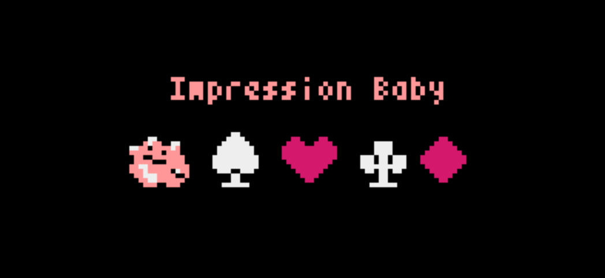

# Impression Baby

## Project Description
This is a single player game inspired by BS poker, where you play with Baby (a reinforcement machine learning algorithm) who learns your strategy over the course of the game.

## Inspiration
We wanted to make the opponent "smart", forcing the player to change strategies over the rounds in this simple game.

## Rules
- 2 players: you and Baby
- Each player gets 3 cards randomly from the whole deck of cards, you only know your own 3 cards.
- You enter a guess, which includes a quantity between 1 and 6 and a value between 1 and 13 or a suit (e.g. 3 9’s, 2 Spades) 
- Baby enters true or false (BS)
- If Baby correctly judged that you guess is included/not included in the 6 cards, it gets *6-x* points.
- If not, you get *x* points.

## What's next
- More complex game rules (claim could include flush, full house, etc)
- Each round Baby gets to return a higher claim instead of simply saying True or False
